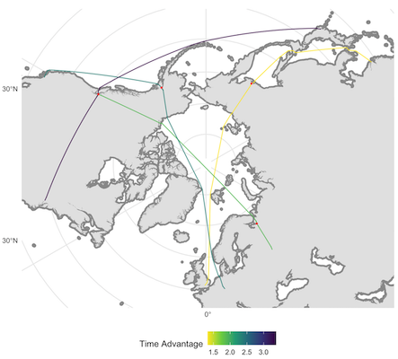

<!-- README.md is generated from README.Rmd. Please edit that file -->

# `himach`

<!-- badges: start -->
[](https://CRAN.R-project.org/package=himach)
<!-- badges: end -->

The goal of `himach` ("high Mach") is to support modelling and analysis of the market for supersonic aircraft by generating good routes for aircraft which can fly supersonic over the ocean, but only subsonic over land. 

In this version of `himach`, 'good' usually means the fastest, so the key indicator is time advantage over flying in a subsonic aircraft. 

{width=80%}

It is not an operational tool. Please don't fly these routes, which do not allow for wind or other atmospheric conditions, and are based on a very simple model of aircraft performance.

## Installation

You can install the latest CRAN release using:

```r
install.packages("himach")
```

You can install the current development version of `himach` from github with:

``` r
install.packages("devtools")
devtools::install_github("david6marsh/himach")
```

For the vignette and testing, this package uses a map of New Zealand map based on Stats NZ's data which are licensed by Stats NZ for re-use under the Creative Commons Attribution 4.0 International licence. Map shown above uses data from www.naturalearthdata.com, from through the `rnaturalearthdata`, and `rnaturalearthhires` packages. 

## Why `himach`?

A second generation of supersonic passenger aircraft is under development (taking Concorde to be the first generation). These will normally fly supersonic over the ocean, and subsonic over land. So their routes are _not_ well-approximated by a great circle.

* Market study: If you want to estimate demand for these aircraft, then a key selling point is the time savings they bring. `himach` calculates this time advantage.
* Emissions modelling: If you want to model some aspects of emissions, then you need to know the duration and length of flights (as well as the size of the market): `himach` helps with this, at least for the en route phase.
* Airspace impact: If you want to see which areas of the airspace might be affected, then routes from `himach` will help, though not around airports in this version.
* Flying a supersonic aircraft: No, not `himach`. You're going to need something with a much more precise model of aircraft performance, not to mention information on weather, route and airspace availability, runways in use etc.

A route from `himach` looks something like this, shown in green on the map. The great-circle route is shown in thin light blue, for comparison. To avoid that the sonic boom reaches land, we have added a buffer around the coast, shown in dark grey.


If we plot a speed view of the same thing, we see that the route maximises the distance over which supersonic speeds may be maintained. 

{width=70%}

Compared to some of the larger subsonic passenger jets, the second generation supersonics are expected to have relatively short range. So finding efficient re-fuelling points is an essential part of the modelling process. This map shows some examples (the results depend on which airports you make available as possible re-fuelling points).

{width=80%}

Other useful features of `himach` include:

* one-stop calculation of hundreds of routes, with functions then to plot and summarise;
* summary indicators such as average speed and circuity, to help filter out routes where the aircraft is not likely to have an advantage;
* time advantage is calculated by default against a Mach0.84 subsonic aircraft, but subsonic aircraft can be routed to provide alternative comparisons;
* option to close off airspace where overflights are not allowed or not advised;
* map plotting using four quick-view coordinate reference systems (Atlantic, Pacific and 2 polar views), and ability to use other 'CRS' if required;
* plotting of route-range envelopes, to help understand routing options (why didn't it stay over the ocean here? why didn't it refuel there?).

{width=50%}

## Getting Started

The routes shown here are specific to the input data: it used a test aircraft and open source geographic data. See the vignettes for a worked example of how to get your own data into `himach`.

You need maps and airport data, both available from other R packages, as the vignette shows. This package provides a short list of aircraft for illustration purposes only, the aircraft data were taken from Wikipedia and most-likely out of date. Add your own aircraft performance data: the vignette shows how.

