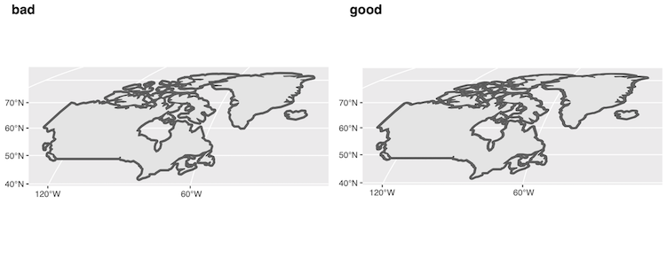
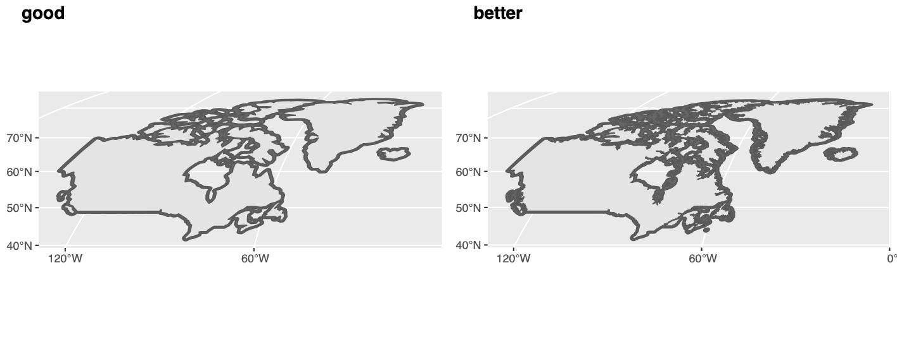

# Introduction

[Supersonic Routes](Supersonic_Routes.html) provides a quick end-to-end introduction to using the `himach` package and is the place to start. This vignette provides advice on more advanced use, explaining details that the introduction skates over.

Much of this vignette is optional or for occasional use, but the advice on saving and reading the cache is likely to be _essential_ for a speedy workflow, so that is described first. 


```{r, include = FALSE}
knitr::opts_chunk$set(
  collapse = TRUE,
  comment = "#>"
)
```

```{r setup}
#the libraries needed for the vignette are
library(himach)
library(dplyr, quietly = TRUE, warn.conflicts = FALSE)
library(ggplot2)
library(sf)

# and we'll load a full set of test data
NZ_coast <- hm_get_test("coast")
NZ_buffer30 <- hm_get_test("buffer")
NZ_Buller_buffer40 <- hm_get_test("nofly")
NZ_grid <- hm_get_test("grid")
NZ_routes <- hm_get_test("route")
```


# Cache Management {#cache}

`himach` uses caching to speed things up. Legs are cached in `route_cache` and arrival-departure links to airports are cached in `star_cache` (STAR is short for standard arrival route, its counterpart being SID the standard instrument departure).

You will want to save and load the cache (meaning the combination of `route_cache` and `star_cache`) as part of your standard workflow. Quite where you save it is up to you, but a set of routes is sensitive to (a) the route grid on which it is calculated (b) the list of aircraft used, and their performance. The saving function `hm_save_cache` forces you to refer to these two datasets, and uses metadata from them in the file name for the cache. 

If you change either of these, then you can use `hm_clean_cache()` to empty the cache. You will also note that if you run `find_routes` and the map has changed, or `findToCToD` and the map or aircraft have changed, then the cache will be cleared automatically.

For the vignette, we save to a temporary directory. You really don't want to do this in practice ;-) 

```{r cache saving} 
hm_clean_cache() #start without cache

# need to load some of the built-in data for this example
aircraft <- make_aircraft(warn = FALSE)
airports <- make_airports(crs = crs_Pacific)

options("quiet"= 2) # for a little reporting
# how long does it take with an empty cache?
system.time(
  routes <- find_route(aircraft[1, ],
                       make_AP2("NZAA", "NZDN", airports),
                       fat_map = NZ_buffer30,
                       route_grid = NZ_grid,
                       ap_loc = airports)
)

# test saving of cache to a disposable directory
tmp_dir <- tempdir()
# for convenience, hm_save_cache gives the full name, including path
full_filename <- hm_save_cache("test_v", NZ_grid, aircraft, path = tmp_dir)

#empty cache - just to demonstrate the re-loading
# this isn't part of your normal workflow!
hm_clean_cache() 
# but normally a session will begin with loading a cache like this
hm_load_cache(full_filename)

# how long does it take with a cache?
system.time(
  routes <- find_route(aircraft[1, ],
                       make_AP2("NZAA", "NZDN", airports),
                       fat_map = NZ_buffer30,
                       route_grid = NZ_grid,
                       ap_loc = airports)
)


# if you want to see a map
# map_routes(NZ_coast, routes, crs_Pacific, fat_map = NZ_buffer30, simplify_km = 2)
```
  
The cache just works invisibly in the background - you will notice it speeds up finding of routes no end: in that example, from 1.5s (user) to 0.04s (user) on my machine. In particular, it helps with refuelling, because the `route_cache` quickly remembers the routes from major hub airports to the main refuelling points, so they don't need to be calculated again.

Incidentally, if you add a new refuelling point, then the cache remains _valid_ because only **legs are cached, not routes**. With a new refuelling point, `find_route` will check both old legs and new (to the new refuelling points), gaining where the legs are cached, before selecting the best combination of legs to make the route.

## Cache housekeeping (advanced)

There may be times when you have built a large cache, of several thousand routes for a handful of aircraft. If you want to make a change to the performance of one aircraft, say, you either need to `hm_clean_cache()` and start everything again, or do a bit of housekeeping. The same is true if an airport location needs correcting: ideally we delete all references to just that airport.

If you're not comfortable housekeeping, then just let `himach` run overnight to redo the whole thing. 

Housekeeping involves loading the cache manually, with `load`. It contains two environments `route_cache` and `star_cache` (segments to and from airports). The items in the cache are named with strings which capture a number of run parameters, including the aircraft ID. So we identify items for deletion, and `rm` them. Then save the cache manually with `save`.

```{r cache housekeeping}
# for this example, add a second route to the cache
routes <- find_route(aircraft[2, ],
                       make_AP2("NZAA", "NZDN", airports),
                       fat_map = NZ_buffer30,
                       route_grid = NZ_grid,
                       ap_loc = airports)
# save the cache, which has NZAA-NZDN for 2 aircraft now
hm_save_cache("test_v", NZ_grid, aircraft, path = tmp_dir)

#now do housekeeping
load(full_filename) # filename from the previous chunk
ls(route_cache) # show the contents, just for information
# we want to delete instances of aircraft with ID that includes 'M22'
z <- ls(route_cache, pattern="M22") |> as.list()
length(route_cache) # before deletion
do.call(rm, z, envir = route_cache) # delete the M22 items
length(route_cache) #after deletion, 1 less
# then repeat for star_cache
z <- ls(star_cache, pattern="M22") |> as.list()
length(star_cache)
do.call(rm, z, envir = star_cache)
length(star_cache)
# then save the result (you might want to change the filename, or backup the old cache beforehand)
save("route_cache", "star_cache", file = full_filename)
```

# Extra Plots
## Route density plots {#route_density}

The function `map_routes` does a reasonable job of showing where the supersonic aircraft will fly, but it has two notable limitations. Firstly, when you have scores or hundreds of routes, the overlapping of routes begins to reduce the readability of the map. Secondly, some routes are likely to be flown more often than others: Paris-New York once a day, perhaps, while Copenhagen-New York only twice per week.

In this vignette, we show how to plot the _density_ of routes, taking into account overlap and flight frequency. While a density map might serve some needs, a simpler bar chart is a fairly clear way to summarise total quantity (of flown hours) by, say, latitude, which can be of interest for atmospheric modelling.

The process is fairly mechanical. We'll either do a latitude or a longitude bar chart, using a single function. We assume you've calculated a set of routes, in which you have only one 'best' route per `acID` and `routeID` (so have got rid of any different refuelling options, for example).

The frequency of each is '1' by default. Given the label 'hours per week', this corresponds to 1 flight per week. If you want different frequencies for each route, you need to pass a dataframe with 3 columns: identifiers `acID` and `routeID`, and a value for flights per week in `flights_w` which does not have to be an integer. See the parameters for how to drop `acID`, say. If you want flight hours per year, say, then you need to switch the values in and name of `freq_var`.

If you're running a forecast, you will have different routes and frequencies in different years and different scenarios. The plot will be faceted by `year` and `scen_ord`. These variables should also be in your frequency dataset, and for faceting should be factors or integer. We use `scen_ord` rather than `scenario` to indicate an ordered factor, so that they can always be plotted in 'low, base, high' order rather than alphabetical.

```{r define_density_plot_fn}

hm_latlong_density <- function(rt, # route dataset created earlier
                               ll = "lat", #lat or long chart?
                               # frequency data, either 1 or
                               # dataset with at least 5 columns
                               freq = 1, 
                               # 2 for joining
                               join_var = c("acID", "routeID"),
                               # 1 for value
                               freq_var = flights_w,
                               freq_lab = "Hours per week",
                               # and 2 for faceting
                               facet_rows = vars(year), #or use NULL
                               facet_cols = vars(scen_ord, acID),
                               # other plot configuration elements
                               bar_deg = 3, # width of bar plotted in degrees
                               resolution_deg = 1, # granularity of analysis, keep small
                               # ignore when flights are stationary (refuelling)
                               drop_zero = TRUE,
                               # return a graph, or a set of data
                               return_data = FALSE){
  # graph of lat or long?
  sel_coord <- ifelse(ll |> 
                        stringr::str_to_upper() |> 
                        stringr::str_sub(1, 2) == "LA",
                      2, 1)
  coord_label <- ifelse(sel_coord == 2, "Latitude (deg)", "Longitude (deg)")
  
  rt <- rt |>
    ungroup() |> #just in case supplied dataset is grouped
    # standard route dataset will have all of these
    # each row is a great circle segment
    # in particular time_h is the flight time in hours for the segment
    select(phase, phaseID, gc, acID, routeID, speed_kph, time_h, crow) |>
    mutate(seg = row_number()) # note this is ungrouped
  # this is a graph of flight time, so ignore time spent on the ground refuelling
  if (drop_zero) rt <- rt |>
    filter(speed_kph > 0)
  
  if (is.data.frame(freq)) {
    # zoom in on the variables we need
    freq <- freq |>
      ungroup() |>
      select(all_of(join_var), {{freq_var}}, scen_ord, year)
    
    rt <- rt |>
      inner_join(freq, by = join_var, relationship = "many-to-many")
  } else {
    rt <- rt |>
      mutate(flights_w = 1)
    facet_rows <- NULL
    facet_cols <- vars(acID)
  }
  
  # split the great circle arcs into the graph resolution
  rt <- rt |>
    # ensure fine resolution
    sf::st_segmentize(units::set_units(resolution_deg, degree)) |>
    # drop the sf geometry, without dropping the gc column
    sf::st_set_geometry("crow") |> # we only kept this to sacrifice it here
    sf::st_drop_geometry() |>
    group_by(across(!gc)) |> #don't want to lose any var in the reframe
    # the reframe is to pull out either lat or long coordinate
    reframe(coord = st_coordinates(gc)[ , sel_coord]) |>
    group_by(across(any_of(c("seg", "scen_ord", "year")))) |> # now keep one entry per segment/resolution
    # drop the last row if there's more than one, because we want to count line segments really
    slice(1:max(1, n()-1)) |>
    #round to the graph resolution
    mutate(coord = resolution_deg * floor(coord / resolution_deg)) |>
    distinct() |>
    # time_h is the flight time in hours for the great circle segment
    # now shared, after st_segmentize, amongst n() subsegments
    mutate(time_h = {{freq_var}} * time_h / n(),
           bar_coord = bar_deg * round(coord/bar_deg))
  
  # then use geom_bar to add up the times, across all flights
  g <- ggplot(rt, aes(bar_coord,
                      fill = phase,
                      weight = time_h)) +
    geom_bar()  +
    facet_grid(rows = facet_rows, cols = facet_cols) +
    labs(y = freq_lab, x = coord_label)
  # orient appropriately for long or lat
  if (sel_coord == 2) g <- g +
    coord_flip()
  
  if (return_data) return(rt) else return(g)
}
```

We'll show an example or two and then explain in a bit more detail how the graph ends up showing flight hours.

```{r density_examples}
# simple case with default 1 flight/week frequency
hm_latlong_density(NZ_routes, facet_rows = NULL, facet_cols = vars(acID),
                   bar_deg = 0.5, resolution_deg = 0.1)

# make up a forecast of frequencies
freq_fc <- NZ_routes |> 
  # get the ac & routes we need the forecast for
  select(acID, routeID) |> 
  st_drop_geometry() |> # convert from sf to tibble
  distinct() |> 
  # add in some forecast years
  tidyr::crossing(tibble(year = c(2040L, 2050L))) |> 
  # add in some scenarios
  tidyr::crossing(tibble(scen_ord = ordered(c("low", "base", "high"), 
                                            levels = c("low", "base", "high")))) |> 
  # and some flights per week (that don't make a lot of sense)
  arrange(year, scen_ord) |> 
  mutate(flights_w = row_number()) 
  
hm_latlong_density(NZ_routes, ll = "long", 
                   freq = freq_fc,
                   bar_deg = 0.5, resolution_deg = 0.1)

```

These illustrate strong (mode) peak of flight demand around 41 degrees South and 174 degrees East.

To get the flight hours per week we use the `time_h` property in the routes data. This gives the duration, in hours, to fly the great circle arc in this row of the data. For graphing purposes, we split each great circle row into multiple sub-arcs using `reframe`, which is like `summarise` but you can end up with more rows than you started with. We aim for significantly smaller sub-arcs than the bar bin width (a sub-arc is just an arc). We share `time_h` equally amongst those sub-arcs and extract the start (lat or long) coordinate of the sub-arc. Multiply by the flight frequency to get hours per week for each sub-arc. The `geom_bar` then just adds up the hours per week for all the sub-arcs (starting) in that bin. All this is summarised in the comments in the function.

# Route-finding details
## No-fly zones

It is not unusual for parts of the airspace to be closed, or be considered unsafe for flying. `himach` allows regions to be marked as 'avoid'. They will not feature in the grid, so routes will avoid them, with one exception: an arrival or departure airport can be inside a no-fly zone, as long as at least one connection point to the grid is outside. So they might more precisely be called 'no-overfly' zones.

A no-fly zone is prepared in the same way as a map of land. If specific countries are to be avoided, this is where having a country name in the geographic data comes in handy.

One essential item is the `avoid` attribute of the no-fly zone. This is used to distinguish sets of legs with different, or no, no-fly zone. Set `attr(your_avoid_map, "avoid") <- "your summary of that avoid map"` which will (a) remind you what was used (b) tell `himach` to recalculate all legs that have not already been calculated with that value of `avoid`. If you were to add an avoid area for North Korean airspace, say, then in reality North Atlantic routes are not affected, but currently `himach` plays safe and assumes that they are.

In this example, no offence is intended to the citizens of Buller District of New Zealand; it is a convenient example for showing how routes are forced to change when airspace is unavailable.

```{r createBuffer}
# using your own shp file 
# NZ_Buller <- sf::read_sf("...../territorial-authority-2020-clipped-generalised.shp") %>% 
#     filter(TA2020_V_1 == "Buller District")
# NZ_Buller_u <- sf::st_union(sf::st_simplify(NZ_Buller, dTolerance = 1000))
# NZ_Buller_buffer50 <- sf::st_union(sf::st_buffer(NZ_Buller_u, 50 * 1000))
# attr(NZ_Buller_buffer50, "avoid") <- "Buller+50km"
# the quicker version, using a built-in no fly zone

# this uses data as in the previous code chunk
aircraft <- make_aircraft(warn = FALSE)
airports <- make_airports(crs = crs_Pacific)

# run the same route, but with the avoid region
options("quiet"= 2) #just the progress bar
ac <- aircraft[c(1, 4), ]$id
routes <- find_routes(ac, 
                      data.frame(ADEP = "NZAA", ADES = "NZDN"),
                      aircraft, airports,
                      fat_map = NZ_buffer30, 
                      route_grid = NZ_grid,
                      cf_subsonic = aircraft[3,],
                      avoid = NZ_Buller_buffer40)

#this shows versions of the legs with and without no-fly
# ls(route_cache, pattern = "NZCH", envir = .hm_cache)

# create route summary
rtes <- summarise_routes(routes, airports)

# draw a basic map
map_routes(NZ_coast, routes, crs_Pacific, fat_map = NZ_buffer30,
          avoid_map = NZ_Buller_buffer40,
          simplify_km = 2)

map_routes(NZ_coast, routes, show_route = "aircraft",
           crs = crs_Pacific, fat_map = NZ_buffer30,
          avoid_map = NZ_Buller_buffer40,
          simplify_km = 2)

```

## Why do I have `NA` routes?

After a call to `find_routes`, the output can have `NA` entries in some columns for some routes. There are two reasons for this:

* This airport pair is too far for a single leg for this aircraft. If you have given a list of possible refuelling airports `refuel = xxx`, then you will find other entries for the same `routeID` (eg "EGLL<>KSFO") but with different `fullRouteID` (eg "EGLL<>PANC<>KSFO") showing a good route including refuelling.
* One of the airports may be unreachable because all of the top-of-climb (=top-of-descent) points are within an avoid airspace. You will have received a warning message at the end of the run of `find_routes`.

So these appear when the specified route is not possible.

## Too many ocean routes: Buffer widths and projections {#bufferaccuracy}

Above 60 or 70 (North or South), the approximations used by the `st_buffer` function begin to show signs of exceeding their limits. In particular, if you're adding a 50km coastal buffer, for example, there are separations between Canadian islands which are just under 100km. Borden and Ellef Ringnes are examples. A buffer generated by `st_buffer` shows the strait between them as open water, where it should be closed. 

This can lead to over-optimistic routings: supersonic where they should not be. 

The solution is to use the links from `sf` to the `s2` package which come in more recent versions of the `sf` package. This does require you to use quite a high value for the `max_cells` parameter of `s2::s2_buffer_cells`.

```{r buffers in s2, fig.width=7, eval = FALSE}
gr <- s2::s2_data_countries(c("Greenland", "Canada", "Iceland"))
gr_buffer_s2 <- s2::s2_buffer_cells(gr, distance = 50000, max_cells = 20000) %>%
   st_as_sfc()
m_s2 <- ggplot(st_transform(gr_buffer_s2, crs_Atlantic)) + geom_sf(fill = "grey40") +
   geom_sf(data = st_transform(st_as_sfc(gr), crs_Atlantic))

sf_use_s2(FALSE) # to be sure
gr_transf <- gr %>%
   st_as_sfc() %>%
   st_transform(crs_Atlantic)
gr_t_buffer <- gr_transf %>%
   st_buffer(dist = 50000)
m_old <- ggplot(gr_t_buffer) + geom_sf(fill = "grey40") + geom_sf(data = gr_transf)

cowplot::plot_grid(m_old, m_s2, labels = c("bad", "good"),
                   ncol = 1)

```

 

In fact, the problem of finding too many apparently over-ocean routes is broader than this. The other main contributor to this is missing islands from the map. See the comments [in the first vignette](Supersonic_Routes.html#maps).

An example of this is in the same place. Some maps omit small islands (well, larger ones like Killniq down to tiny ones like Goodwin Island) at the mouth of the Hudson Strait. This affects the apparent width of the opening. Given the islands, and a 50km buffer, the Strait is _not_ open as the next example shows.

This uses a non-CRAN, but public package of hi-resolution maps, `rnaturalearthhires`. If you don't want to load this package, just note the results shown in the figure.

```{r Island Example, fig.width=7, eval = FALSE}
sf::sf_use_s2(TRUE)
hires <- sf::st_as_sf(rnaturalearthhires::countries10) %>% 
  filter(NAME %in% c("Greenland", "Canada", "Iceland"))
hires_buffer_s2 <- s2::s2_buffer_cells(hires, distance = 50000, max_cells = 20000) %>%
   st_as_sfc()
m_hires <- ggplot(st_transform(hires_buffer_s2, crs_Atlantic)) + 
  geom_sf(fill = "grey40") +
   geom_sf(data = st_transform(hires, crs_Atlantic))

cowplot::plot_grid(m_s2, m_hires, labels = c("good", "better"),
                   ncol = 1)

```



# Why do I need a coordinate reference system?

There are a number of place in the vignettes, eg making an airport dataset, where we have shown the use of a parameter to specify a coordinate reference system. `himach` has recently transitioned to using spherical geometry directly using the `s2` package, both directly and through the `sf` package. Before `s2` was available in `sf` there was a constant need to align the coordinate reference systems of objects before combining them.

Now, in theory, all geometrical operations use spherical geometry, so a coordinate reference system should only be needed when you plot a map. At that point, the coordinate reference system is saying how to move from spherical coordinates to a flat projection. Four basic projections are supplied `crs_Atlantic`, `crs_Pacific`, `crs_North` and `crs_South` which you can use in `map_routes` to get the right map for your particular set of routes. You can create others as shown in the vignette.

We will remove remaining references to coordinate reference systems during route creation in later versions of `himach`.


```{r echo = FALSE}
#for tidiness remove the temp file now 
# this is only for passing CRAN tests - you don't need to do it.
unlink(full_filename)

```

